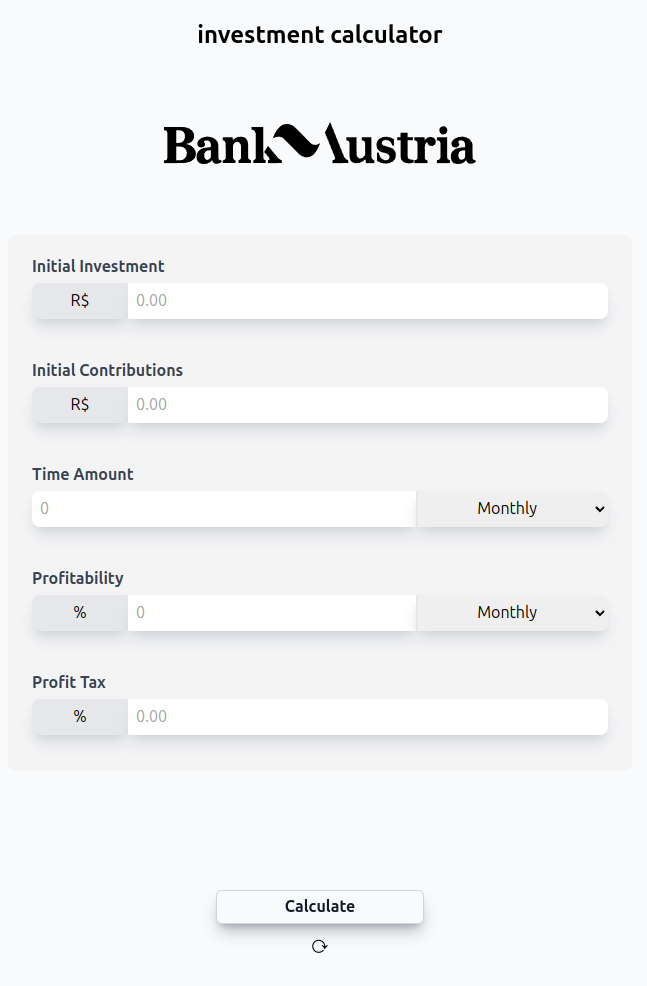

<h1 align="center"> Investment Calculator </h1>

  <a href="#-tecnologias">Tecnologias</a>&nbsp;&nbsp;&nbsp;|&nbsp;&nbsp;&nbsp;
  <a href="#-projeto">Projeto</a>&nbsp;&nbsp;&nbsp;|&nbsp;&nbsp;&nbsp;
  <a href="#memo-licença">Licença</a>

  

 

  

## 🚀 Tecnologias

Esse projeto foi desenvolvido com as seguintes tecnologias:

- HTML e CSS
- JavaScript e JSON
- [Node e NPM](https://nodejs.org/)
- [Vite](https://vitejs.dev/)
- [Chart.JS](https://www.chartjs.org)
- [Tailwind](https://tailwindcss.com/)

## 💻 Projeto

É um sistema que simula uma calculadora de investimentos online, transformando dados inseridos pelo usuário em gráficos potentes para demonstração visual de seus ativos.

## :memo: Licença

Esse projeto está sob a licença MIT.
